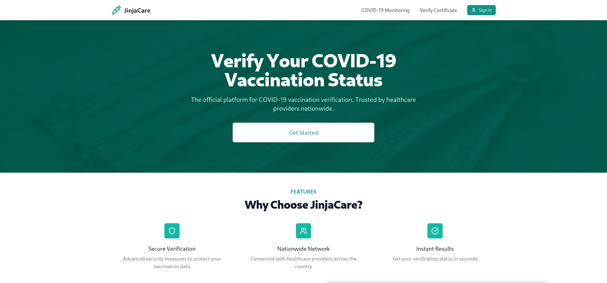
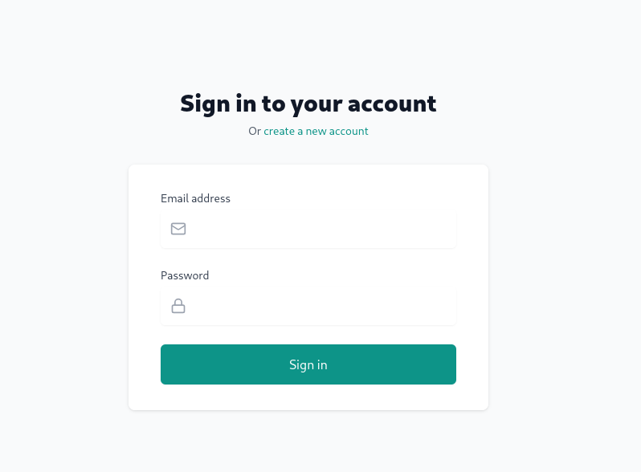
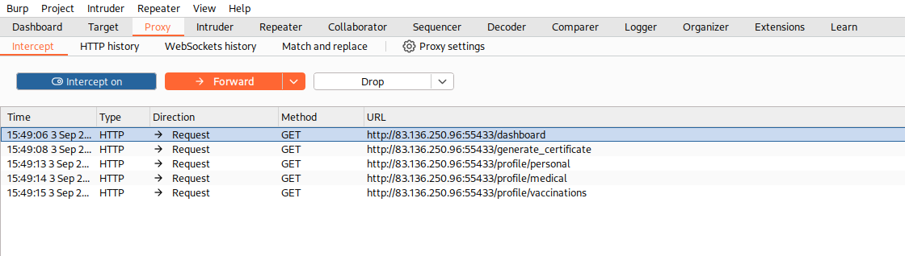
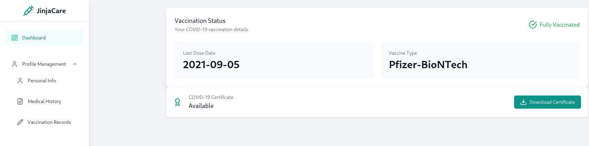
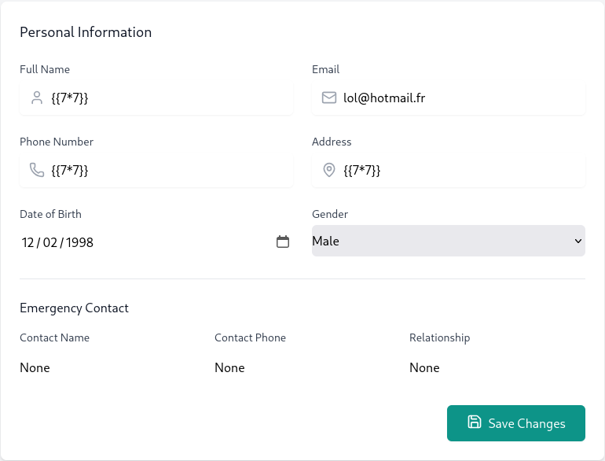
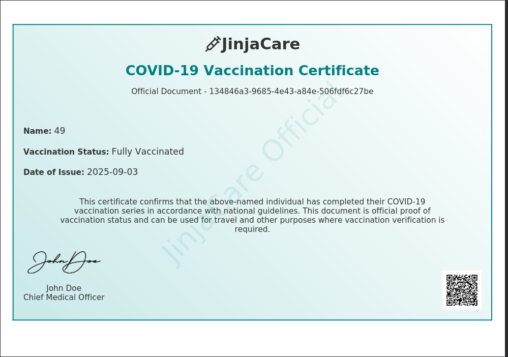
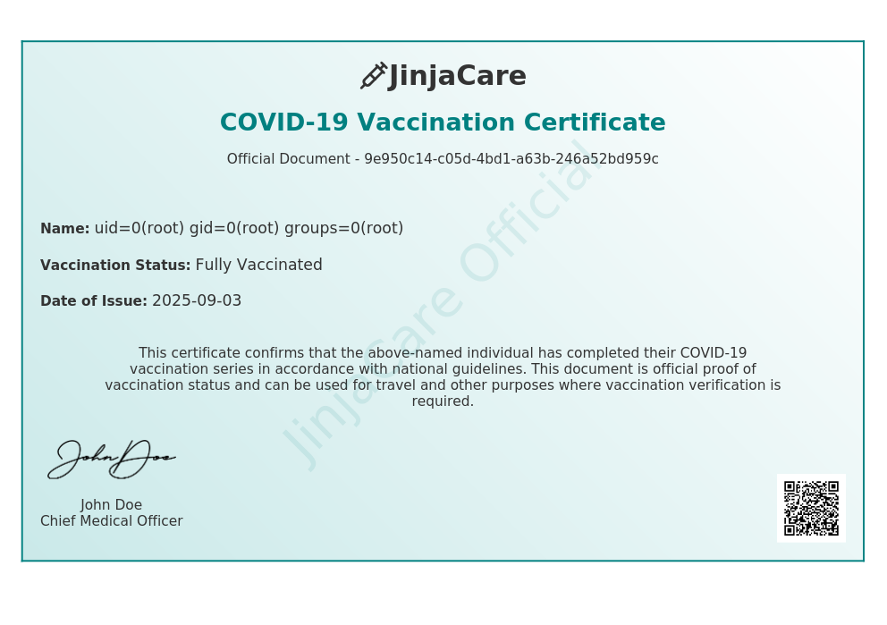
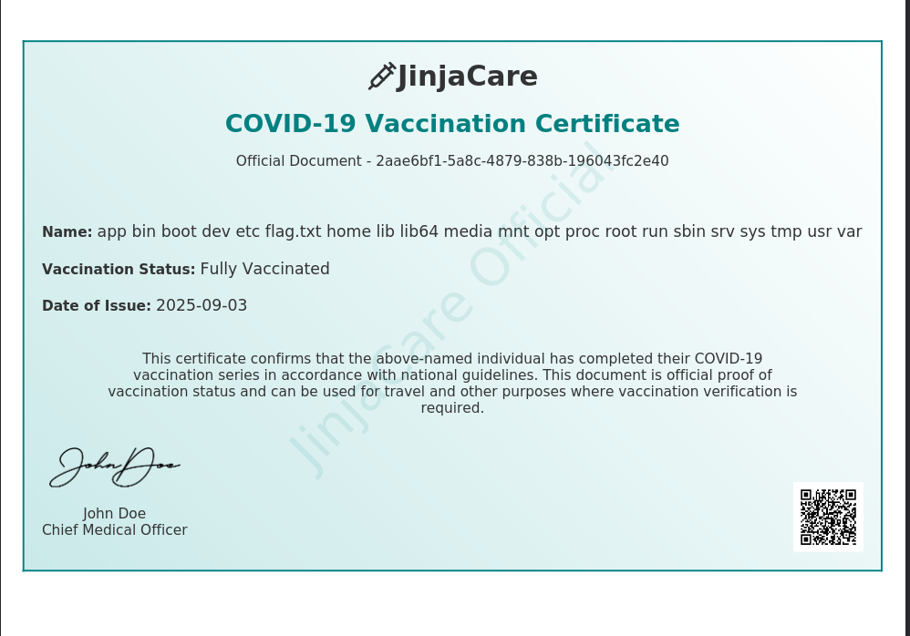
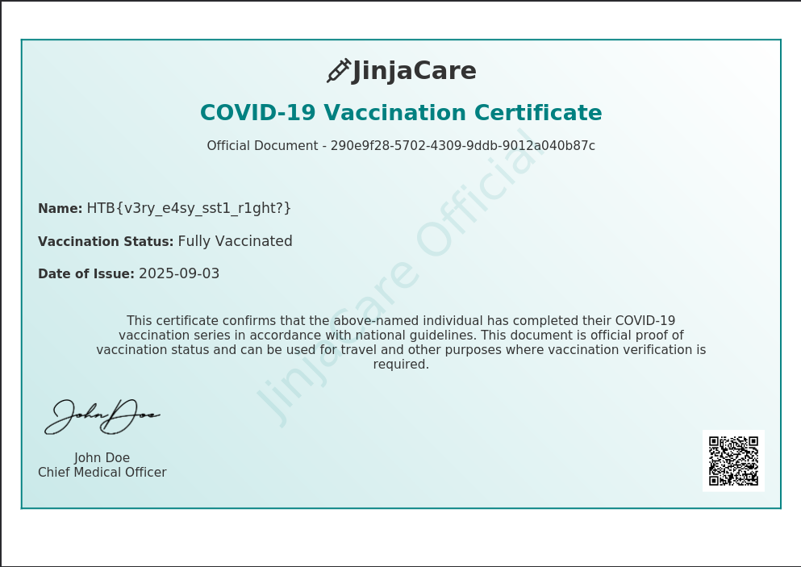

**Pentest Report — JinjaCare**

**Platform:** HackTheBox

**Analyst:** Kerneth

**Date:** 03/09/2025

**Mission Status:** ✅ Successfully Completed

---

### 🎯 Executive Summary

The following site tested is JinjaCare. It's a website for vaccination status and specially COVID-19 vaccination details.

### 🛠️ Scope & Methodology

* Nmap
* Gobuster
* BurpSuite – interception & endpoint discovery  
* Manual input fuzzing – testing injection points  
* Jinja2 SSTI payloads – template injection exploitation  
* OS command execution – confirmation of RCE

### 🔍 Findings

| Vulnerability         | Impact       | Severity |
| --------------------- | ------------ | -------- |
| SSTI in Personal Info | Leads to RCE | Critical |

The first thing that I have to do is to create an account to access inside the site.

Once this is done, I have search for every endpoints available with BurpSuite.

We can see we've got 5 endpoints.
The First one is Dashboard and the second one is generate_certificate
We can access "generate_certificate" with "Download Certificate" and the utility is to generate a certificate with the our info in "personnal"

And then we've got also personnal, medical and vaccinations. 
The most interesting is "personnal", accessing with Personnal Info. Here you can put your info or anything you want...
"medical" and "vaccinations" are not very interesting.
 
One very good clue, i have noticed is the name of the site : "JinjaCare", and it make me think about the ServerSide Jinja. So the first thing is to test that hypothese.
As I have already see, you can put anything you want in Personnal Info, so to test if there is a SSTI vulnerabilites with Jinja2, I have write {{7*7}}.

We can see the output if we generate the certificate.

And it's effectively a SSTI because it interpreter the 7*7 inside the {{}}.

### 🧩 Exploitation Walkthrough

The next thing is to use this SSTI into a RCE.

I have tested with this code, in the first time with "id"

{{ self._TemplateReference__context.cycler.__init__.__globals__.os.popen("id").read() }}

👉 What it does:

  self._TemplateReference__context → accesses the internal context of the Jinja engine.

  .cycler → a Jinja object that holds references to internal functions.

  .__init__.__globals__ → climbs up to the Python global variables accessible in this context.

  .os → retrieves the os module from those globals.

  .popen("id").read() → executes the system command id and reads its output.

We can see the id, so it worked.

The next step is to find the flag.

I used 
{{ self._TemplateReference__context.cycler.__init__.__globals__.os.popen("ls /").read() }}

to see what we've got in the root directory

And 
{{ self._TemplateReference__context.cycler.__init__.__globals__.os.popen("cat /flag.txt").read() }}

to see what is the flag.

### ✅ Conclusion

The engagement against **JinjaCare** demonstrated a critical vulnerability in the web application:  
a **Server-Side Template Injection (SSTI)** in the “Personal Information” field, which escalated to a full **Remote Code Execution (RCE)** on the host.  

Through controlled exploitation, we confirmed the ability to execute arbitrary system commands and retrieve sensitive files (including the target flag).  

**Impact:**  
An attacker with this access could completely compromise the confidentiality, integrity, and availability of the application and its data.  

**Mission outcome:**  
The target was successfully compromised, mission objectives achieved.  
