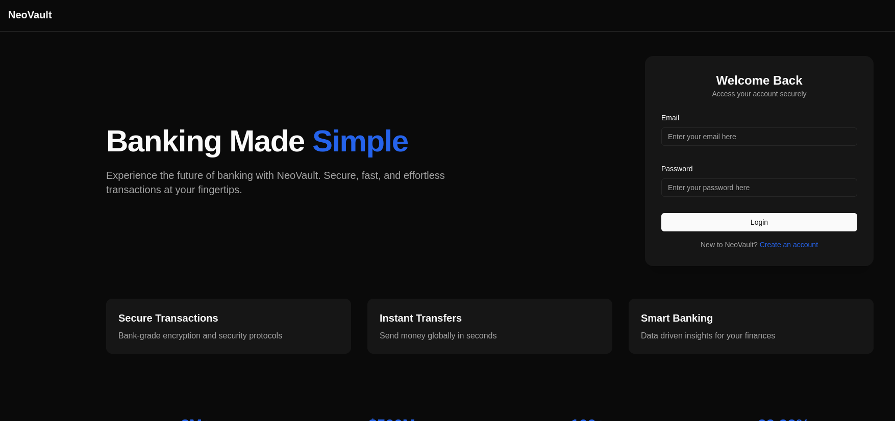
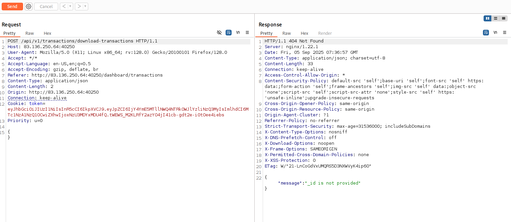
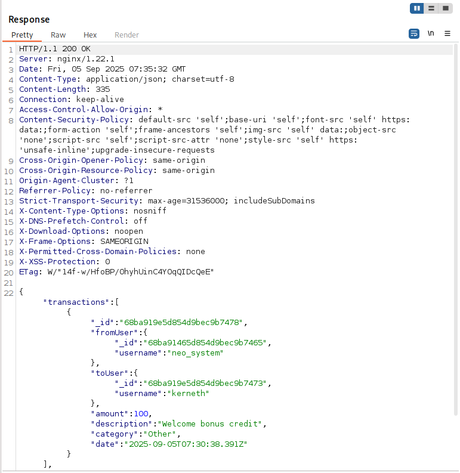
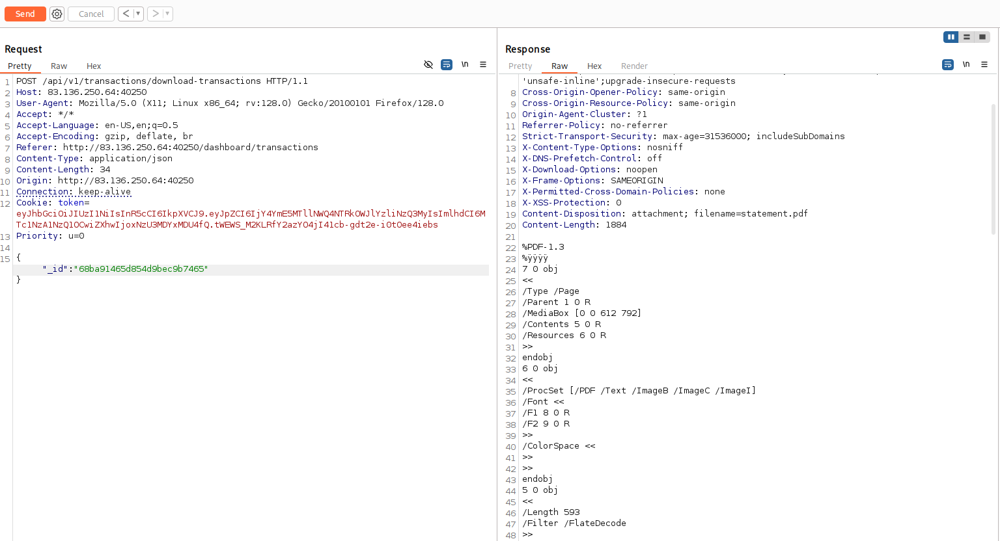
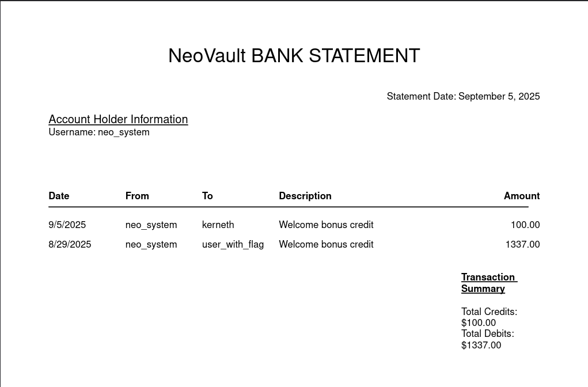
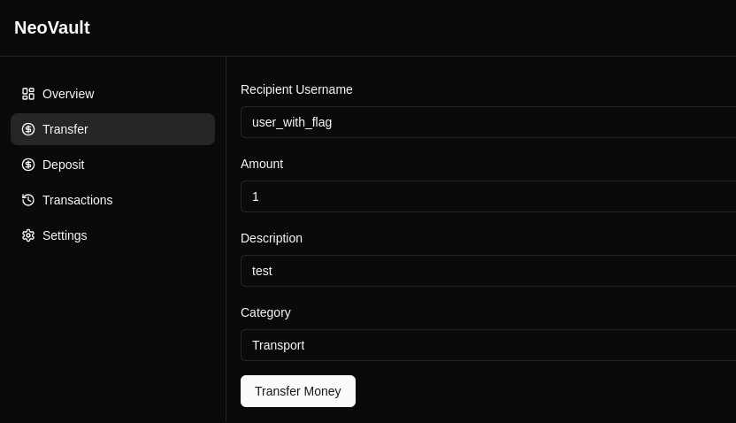
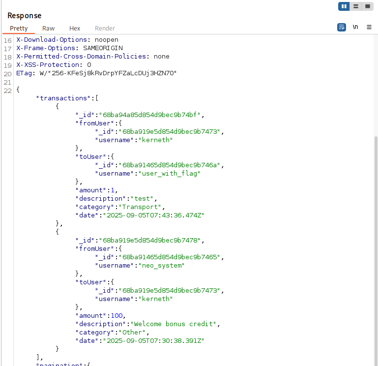
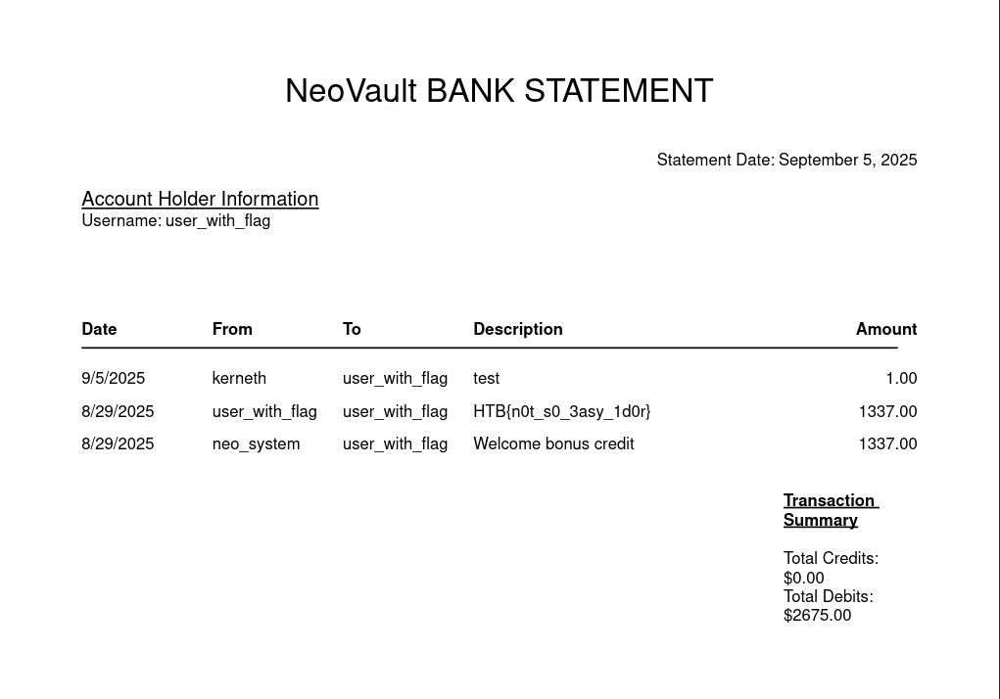

**Pentest Report — NeoVault**

**Platform:** HackTheBox

**Analyst:** Kerneth

**Date:** 09/09/2025

**Mission Status:** ✅ Successfully Completed

---

### 🎯 Executive Summary

The following site tested is NeoVault. It's a trusted banking app for fund transfers and downloading transaction history.

### 🛠️ Scope & Methodology

* Nmap
* Gobuster
* BurpSuite – Interception and analysis of frontend/backend API traffic
* API endpoint discovery – via JS inspection and proxy logging
* Legacy endpoint testing – identification and access to older API versions
* Manual API manipulation – custom request crafting with modified object IDs
* Access control testing – validation of authorization logic on report resources
* IDOR exploitation – accessing reports of other users via modified JSON payloads
* Data extraction – leveraging weak access control to access protected resources

### 🔍 Findings

| Vulnerability             | Impact                                                   | Severity |
| ------------------------- | -------------------------------------------------------- | -------- |
| IDOR in Legacy Report API | Unauthorized access to other users' confidential reports | High     |

The first thing that I have to do is to create an account to access inside the site.

As you can see, we already have 100$ in our bank account thanks to neo_system

I have search for every endpoints available with JS inspection and as we can see we've got 10 endpoints in v1 and 11 endpoints in v2.

When we visit a page with v1, it dosen't seems to work except for /api/v1/transactions/download-transactions (with BurpSuite)

We've got the message "id is not provided", so the next thing is to find some id's and there are in transactions

When we put the id of neo_system, there is, indeed, an IDOR.

### 🧩 Exploitation Walkthrough

The next thing is to use this IDOR to got unauthorized access to other users' confidential reports.
After modifying the request with BurpSuite (with the id of neo_system and with the old api), we have been able to obtain the document of their transactions

The "user_with_flag" seems interesting, so we need to have his id. To do this, we just need to send them some money and to repeat the first operation.

Now we just need to put his id and retrieve his transaction report

### ✅ Conclusion

During the assessment of the NeoVault platform, a significant security vulnerability was discovered in a legacy version of the transaction reporting API. By leveraging inadequate access controls on the /api/v1/transactions/download-transactions endpoint, it was possible to perform an Insecure Direct Object Reference (IDOR) attack and gain unauthorized access to transaction reports belonging to other users.

This exploitation relied on:
Discovering and interacting with a legacy API version still accessible in production
Manipulating object IDs within API requests to retrieve sensitive documents
Absence of proper user-to-resource authorization checks on the server side

The issue demonstrates a common but critical flaw in API security: relying on client-side filtering without enforcing robust server-side access control. In a real-world environment, this vulnerability would have resulted in the exposure of confidential financial records, potentially violating data protection regulations (such as GDPR) and damaging user trust.

The challenge highlights the importance of:
Proper deprecation and removal of old API versions
Server-side validation of user permissions for every resource access
Defensive design in API endpoints to prevent enumeration and object tampering

Overall, this assessment was successfully completed, and the vulnerability was effectively exploited to access restricted user data, validating the presence of broken access control in the system.

**Impact:**  
An attacker with this access could completely compromise the confidentiality and integrity of the users.  

**Mission outcome:**  
The target was successfully compromised, mission objectives achieved.  
